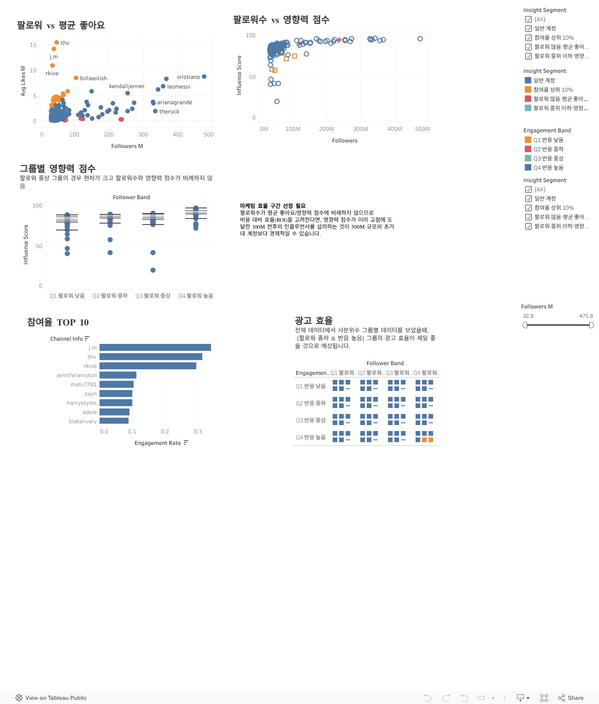

# Instagram Influencer Analysis 📊

## 프로젝트 소개
인스타그램의 상위 인플루언서 데이터를 수집 및 전처리하여, 그들의 영향력, 참여율, 국가 등 다양한 요소를 분석하고 이를 Tableau 대시보드로 시각화하는 프로젝트입니다.

## 폴더 구조
- `notebooks/`: 데이터 전처리 및 EDA(탐색적 데이터 분석)를 진행한 Jupyter Notebook 코드
- `data/processed/`: 전처리가 완료되어 Tableau 시각화에 바로 사용할 수 있는 정제된 데이터셋
- `dashboard/`: Tableau Public 대시보드 링크가 포함된 문서
- `assets/`: 대시보드 썸네일 등 기타 자료 이미지

## 주요 분석 내용 (Tableau Dashboard Insights)
대시보드에서는 다음과 같은 핵심 지표 및 인사이트를 시각화하였습니다.

1. **인플루언서 세그멘테이션 (Insight Segments)**
   - 전체 인플루언서를 `참여율 상위 10%`, `팔로워 많음·평균 좋아요 낮음`, `일반 계정` 등의 그룹으로 분류하여 타겟 마케팅에 적합한 인플루언서 유형을 도출.
2. **팔로워 수와 참여율(Engagement Rate)의 상관관계**
   - 팔로워 수(Follower Band)와 실제 반응률(Engagement Band) 간의 비례/반비례 관계를 분석하여 허수 팔로워 여부 및 실질적인 영향력 평가.
3. **종합 영향력 지수 (Balanced Influencer Score)**
   - 단순 팔로워 수가 아닌 최근 60일 참여율, 평균 좋아요 수 등을 0~100점 척도로 환산하여 자체적인 균형 잡힌 영향력 점수(Balanced Score) 산출.
4. **국가별/랭크별 인플루언서 분포 현황**
   - 글로벌 탑 200 인플루언서의 국가별 분포 및 랭크 그룹(Top 10, 11-50 등)에 따른 트렌드 비교 분석.

## 활용 기술
- **Python**: Pandas (데이터 전처리 및 결측치, 파생 변수 생성)
- **Tableau**: 데이터 시각화 및 대시보드 제작

## 대시보드 보기 (Tableau Public)
[](https://public.tableau.com/views/5_6_17781243092660/4_1?:language=ko-KR&:sid=&:redirect=auth&:display_count=n&:origin=viz_share_link)

*위 이미지를 클릭하시면 인터랙티브 대시보드로 이동합니다.*

### 웹사이트 삽입용 임베드 코드 (Embed Code)
만약 깃허브 외의 웹사이트나 개인 블로그(HTML 지원 환경)에 대시보드를 직접 화면에 삽입하고 싶으시다면 아래 코드를 복사해서 사용하세요.

```html
<div class='tableauPlaceholder' id='viz1778126596238' style='position: relative'><noscript><a href='#'></a></noscript><object class='tableauViz'  style='display:none;'><param name='host_url' value='https%3A%2F%2Fpublic.tableau.com%2F' /> <param name='embed_code_version' value='3' /> <param name='site_root' value='' /><param name='name' value='5_6_17781243092660&#47;4_1' /><param name='tabs' value='no' /><param name='toolbar' value='yes' /><param name='static_image' value='https:&#47;&#47;public.tableau.com&#47;static&#47;images&#47;5_&#47;5_6_17781243092660&#47;4_1&#47;1.png' /> <param name='animate_transition' value='yes' /><param name='display_static_image' value='yes' /><param name='display_spinner' value='yes' /><param name='display_overlay' value='yes' /><param name='display_count' value='yes' /><param name='language' value='ko-KR' /></object></div>                <script type='text/javascript'>                    var divElement = document.getElementById('viz1778126596238');                    var vizElement = divElement.getElementsByTagName('object')[0];                    vizElement.style.width='1300px';vizElement.style.minHeight='1527px';vizElement.style.maxHeight='2227px';vizElement.style.height=(divElement.offsetWidth*0.75)+'px';                    var scriptElement = document.createElement('script');                    scriptElement.src = 'https://public.tableau.com/javascripts/api/viz_v1.js';                    vizElement.parentNode.insertBefore(scriptElement, vizElement);                </script>
```
